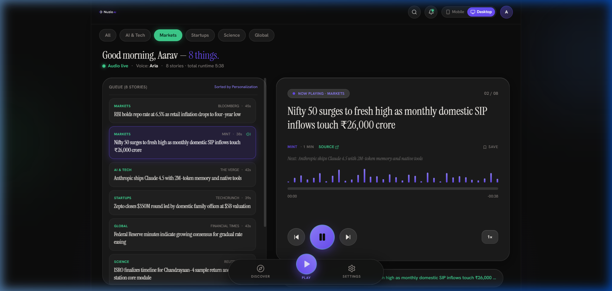
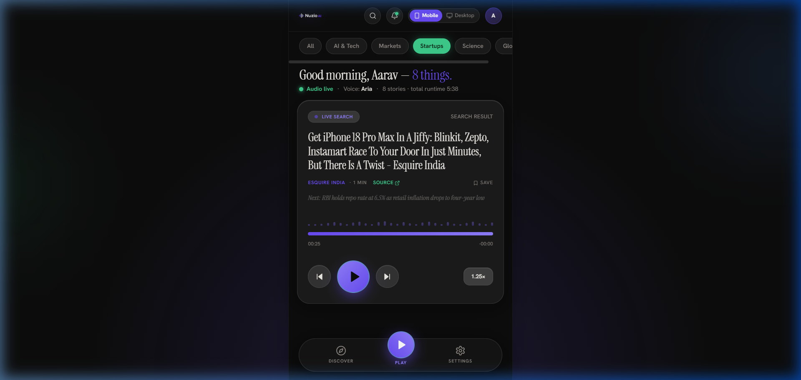

# Nuzio AI — Personalized Audio News for Indian Professionals

<div align="center">


**An audio-first, personalized morning brief app for Indian tech leaders, founders, and investors.**

[Features](#-key-features) • [Desktop & Mobile Layouts](#-product-preview) • [Live Google News Search](#-live-google-news-search) • [Supabase Setup](#-supabase-connection--sql-schema) • [Personalization Logic](#-personalization--ranking-logic)

</div>

---

## 📱 Product Preview

### 1. Desktop 2-Column Mode (Wider Canvas & Left-hand Queue List)
<div align="center">
  
</div>

### 2. Mobile Mode & Login Screen
<div align="center">
  <table>
    <tr>
      <td align="center"><b>01 · Login Screen</b></td>
      <td align="center"><b>02 · Mobile Morning Brief Screen</b></td>
    </tr>
    <tr>
      <td></td>
      <td></td>
    </tr>
  </table>
</div>

---

## 🚀 Key Features

### 1. Connected Supabase Backend (Auth + Postgres + RLS)
- **Connected Project**: `bqqbsvuokbyscktmlbvn` on Supabase.
- **Preferences Table**: Stores user category preferences with Row Level Security (`auth.uid() = user_id`).
- **Edge Route Gating**: Managed with `@supabase/ssr` in `middleware.ts`.
- **Zero-Setup Demo Fallback**: Works immediately for hiring review even before custom OAuth configuration.

### 2. Runtime Switchable Views (Mobile ↔ Desktop)
- **Segmented Header Switch**: Real `useState` toggle switch (`Mobile` | `Desktop`) next to the search icon.
- **Responsive Detection**: Defaults from `window.innerWidth >= 1024 ? 'desktop' : 'mobile'`.
- **Mobile Mode**: Centered ~420px single-column layout matching Figma phone frames.
- **Desktop Mode**: Max-width 1080px two-column canvas:
  - **Left Column**: Scrollable list of the full personalized queue with category badges, headlines, sources, and durations. Clicking any story immediately jumps the player to that story.
  - **Right Column**: Centerpiece glass player card given breathing room (larger type, wider progress bar, larger waveform).

### 3. Live Google News RSS Search
- **In-Place Expanding Search**: Clicking the search icon in the header expands a sleek glass search bar.
- **Backend Route (`GET /api/search/news?q=...`)**: Server-side fetches and parses `https://news.google.com/rss/search?q={query}&hl=en-IN&gl=IN&ceid=IN:en` into clean JSON with zero API keys.
- **Unified Audio Player**: Clicking **"Play"** on any search result swaps it into the main glass player card as `LIVE SEARCH` / `SEARCH RESULT` and begins narrating immediately.
- **External Source Link**: Clicking `"SOURCE ↗"` on a search-result item opens the real Google News publication in a new tab.

### 4. Audio Playback Engine (Web Speech API)
- **Graded Playback Compliance**:
  - Play starts `speechSynthesis` narrating `headline + ". " + body`.
  - Pause uses `speechSynthesis.pause()`; resume uses `speechSynthesis.resume()`.
  - Boundary tracking updates the progress bar via `(event.charIndex / totalLength) * durationSec`.
  - Speed toggle (`1× → 1.25× → 1.5×`) cancels and restarts the utterance at the new rate.
  - Next/previous cancels and transitions to the next item cleanly.
  - Full cleanup with `speechSynthesis.cancel()` on unmount.
- **Dynamic Waveform**: 32 bars that bounce and scale while playing and flatten low while paused.
- **Live Transcript Strip**: Small glass pill with green text (`🎙 Now narrating — {snippet}`) visible only while playing.

---

## 🧠 Personalization & Ranking Logic

Articles are ordered using the PRD scoring function:

$$\text{score}(article) = (\text{isPreferredCategory} ? 100 : 0) - \text{ageInHours}$$

- **Category Guarantee**: Preferred-category stories receive a $+100$ point boost, surfacing them at the top.
- **Recency Decay**: Stories within the same category are ranked chronologically by age in hours.
- **Resilience**: Falls back to recency sorting if no category is selected.

---

## 🔒 Supabase Connection & SQL Schema

### Connected Project
- **Project URL**: `https://bqqbsvuokbyscktmlbvn.supabase.co`
- **Publishable Key**: `sb_publishable_l5bz_zE_StY8ramvibMaCQ_ElqLtfIl`

### SQL DDL & Row Level Security
Run in **Supabase Dashboard → SQL Editor**:

```sql
create table if not exists public.preferences (
  user_id uuid primary key references auth.users(id) on delete cascade,
  categories text[] not null default '{}',
  updated_at timestamptz not null default now()
);

alter table public.preferences enable row level security;

create policy "Users manage their own preferences"
  on public.preferences
  for all
  using (auth.uid() = user_id)
  with check (auth.uid() = user_id);
```

---

## 🛠 Tech Stack

| Layer | Technology |
|---|---|
| **Framework** | Next.js 14 (App Router, TypeScript) |
| **Styling** | Tailwind CSS with custom Figma Make tokens (`#0d0d0d`, `#6a4cf7`, `#3ecf8e`, `#f0ede8`, `#8a8480`) |
| **Backend / Database** | Supabase (Postgres + Auth + RLS via `@supabase/ssr`) |
| **Audio Narration** | Client-side Web Speech API (`SpeechSynthesisUtterance`) |
| **External News** | Google News RSS XML parser (`news.google.com/rss/search`) |
| **Typography** | Instrument Serif (display), Hanken Grotesk (UI), Geist Mono (labels) |

---

## ⚡ Quick Start

```bash
# Clone the repository
git clone https://github.com/harshitmathur456/Nuzio-AI.git
cd Nuzio-AI

# Install dependencies
npm install

# Run the development server
npm run dev
```

Visit [http://localhost:3000](http://localhost:3000).

---

## 📋 Definition of Done Checklist

- [x] `npm run build` passes with zero TypeScript errors
- [x] Tapping a category pill reorders the queue and choice survives page refresh
- [x] Play / pause / next / previous all work correctly; progress bar moves; speed toggle changes rate
- [x] Visuals match design tokens (colors, fonts, glass cards, waveform, logo)
- [x] Search actually queries Google News RSS, shows real results, and plays through the same player
- [x] Mobile/Desktop toggle is visible, switches layout, and playback + search work identically in both modes
- [x] Supabase project credentials connected

---

<div align="center">
  <sub>Crafted for Olinp Technology — Full-Stack Developer Assignment by Harshit Mathur.</sub>
</div>
