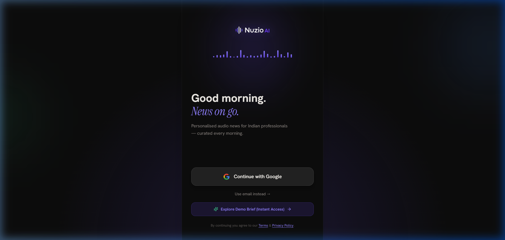
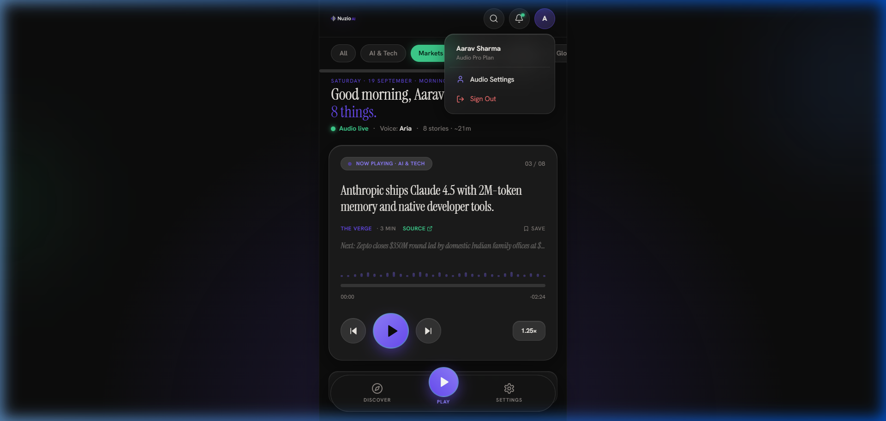

# Nuzio AI — Personalized Audio News for Indian Professionals

<div align="center">


**An audio-first, personalized morning brief app for Indian tech leaders, founders, and investors.**

[Live Demo](#quick-start) • [Architecture](#architecture) • [Design System](#design-system) • [Supabase Setup](#supabase--google-oauth-setup) • [Scoring Algorithm](#personalization--ranking-logic)

</div>

---

## 📱 Product Preview

<div align="center">
  <table>
    <tr>
      <td align="center"><b>01 · Login Screen</b></td>
      <td align="center"><b>02 · Morning Brief Playing Screen</b></td>
    </tr>
    <tr>
      <td></td>
      <td></td>
    </tr>
  </table>
</div>

---

## 🚀 Key Features

### 1. Authentication & Route Gating
- **Google OAuth (Primary)**: 1-click authentication using Supabase Auth with PKCE exchange (`/auth/callback`).
- **Email/Password Fallback**: Allows evaluation without external OAuth app setup.
- **Zero-Config Demo Mode**: Instant 1-click guest access for seamless hiring review.
- **Session Protection**: Edge middleware (`middleware.ts`) automatically gates routes (`signed-out → /login`, `signed-in → /news`).

### 2. Personalized Audio Brief (`/news`)
- **Category Filter Pills**: `All` · `AI & Tech` · `Markets` · `Startups` · `Science` · `Global`. Tapping immediately filters and re-ranks the queue while persisting preference to Supabase with RLS.
- **Glassmorphic Audio Player**:
  - Serif typography (`Instrument Serif`) and metadata badges.
  - Animated 32-bar audio waveform responding dynamically to playback state.
  - Interactive scrubbable progress bar with real-time elapsed/remaining countdown.
  - Audio playback controls: Previous (⏮), Play/Pause (gradient circle), Next (⏭), and Speed Toggle (`1×` → `1.25×` → `1.5×`).
- **Live Spoken Transcript Strip**: Synchronized real-time narration preview (`🎙 Now narrating — ...`).
- **Interactive Modals**:
  - 🔍 **Search Modal**: Real-time filtering across wire feed stories.
  - 🔔 **Audio Broadcast Drawer**: Status telemetry and delivery alerts (7:00 AM IST).
  - ⚙️ **Audio Settings Drawer**: Voice selector (Aria, Kai, Meera), auto-advance toggle, and backend status.

---

## 🧠 Personalization & Ranking Logic

The news queue is ranked using the PRD scoring function:

$$\text{score}(article) = (\text{isPreferredCategory} ? 100 : 0) - \text{ageInHours}$$

- **Category Guarantee**: A preferred-category story always outranks a non-preferred one ($+100$ point boost).
- **Freshness Signal**: Within a category, stories are ordered by recency using decaying age in hours.
- **Resilience**: Falls back to an unfiltered chronological queue if no preferences are saved yet.

```typescript
export function scoreArticle(article: Article, preferredCategories: string[]): number {
  const isPreferred = preferredCategories.length > 0 && 
    !preferredCategories.includes('All') && 
    preferredCategories.includes(article.category);
  
  const ageInHours = (Date.now() - new Date(article.publishedAt).getTime()) / (1000 * 60 * 60);
  return Number(((isPreferred ? 100 : 0) - ageInHours).toFixed(2));
}
```

---

## 🎨 Design System

Tokens extracted directly from the Figma export:

| Token | Value | Description |
|---|---|---|
| **Background (Ink)** | `#0d0d0d` | Deep black background |
| **Violet (Primary Accent)** | `#6a4cf7` | Brand accent & playback buttons |
| **Violet Light** | `#9080ff` | Gradient highlights & badges |
| **Green (Live/Success)** | `#3ecf8e` | Live broadcast indicators & active pill |
| **Cream (Text)** | `#f0ede8` | Primary display & headline typography |
| **Gray (Secondary Text)** | `#8a8480` | Subtitles, timestamps & metadata |
| **Display Font** | *Instrument Serif* | Editorial headlines (italic & regular) |
| **UI Font** | *Hanken Grotesk* | Primary interface typography |
| **Mono Font** | *Geist Mono* | Metadata, timestamps & speed indicators |
| **Card Style** | Glassmorphism | `rgba(255,255,255,0.06)`, `blur(20px)`, `1px border` |

---

## 🛠 Tech Stack

| Layer | Choice | Details |
|---|---|---|
| **Frontend Framework** | **Next.js 14** | App Router, Server/Client components, Edge Middleware |
| **Language** | **TypeScript 5.7** | Strict type safety across models and API routes |
| **Styling** | **Tailwind CSS** | Custom design tokens, glassmorphic utilities |
| **Database & Auth** | **Supabase** | Managed Auth, PostgreSQL database, Row Level Security (RLS) |
| **Session Helper** | **`@supabase/ssr`** | Cookie-based session management across edge middleware & server routes |
| **Audio Narration** | **Web Speech API** | Client-side speech synthesis with rate controls & word-boundary events |
| **Icons** | **Lucide React** | Feather-derived icons matching Figma export |

---

## 🏗 Architecture

```
nuzio-ai/
├── app/
│   ├── api/
│   │   ├── auth/demo/route.ts       # 1-click guest authentication endpoint
│   │   ├── auth/logout/route.ts     # Session teardown endpoint
│   │   ├── news/route.ts            # Ranked news feed API (scoring algorithm)
│   │   └── preferences/route.ts     # Category preference upsert API with RLS
│   ├── auth/callback/route.ts       # Supabase OAuth PKCE exchange handler
│   ├── login/page.tsx               # Screen 1: Login
│   ├── news/page.tsx                # Screen 2: Morning Brief Audio Player
│   ├── globals.css                  # Design tokens & glassmorphism utilities
│   ├── layout.tsx                   # Font imports & mobile shell container
│   └── page.tsx                     # Root redirect
├── components/
│   ├── AppHeader.tsx                # Logo, search, notifications, profile
│   ├── AudioWaveform.tsx            # Animated 32-bar waveform
│   ├── BottomNav.tsx                # Floating dock (Discover, Play, Settings)
│   ├── CategoryPills.tsx            # Filter pills with green active highlight
│   ├── DiscoverModal.tsx            # Full wire feed browsing drawer
│   ├── LiveTranscriptStrip.tsx      # Real-time spoken transcript display
│   ├── Logo.tsx                     # Official Nuzio brandmark
│   ├── NotificationDrawer.tsx       # Live status & morning schedule
│   ├── PlayerCard.tsx               # Glass audio player card
│   ├── SearchModal.tsx              # Real-time search sheet
│   └── SettingsModal.tsx            # Audio voice & backend status
├── lib/
│   ├── newsData.ts                  # Curated wire feed articles
│   ├── ranking.ts                   # Scoring formula implementation
│   ├── types.ts                     # TypeScript data contracts
│   ├── useAudioPlayer.ts            # Web Speech API audio hook
│   └── supabase/
│       ├── client.ts                # Browser Supabase client
│       ├── middleware.ts            # Route protection & session refresh
│       └── server.ts                # Server Supabase client
├── middleware.ts                    # Edge middleware matcher
├── supabase/
│   └── schema.sql                   # Postgres DDL + RLS security policies
└── public/
    └── logo.png                     # Official Nuzio AI logo extracted from Figma
```

---

## ⚡ Quick Start

### 1. Clone & Install
```bash
git clone https://github.com/harshitmathur456/Nuzio-AI.git
cd Nuzio-AI
npm install
```

### 2. Configure Environment (Optional)
Copy `.env.example` to `.env.local`:
```bash
cp .env.example .env.local
```
*(Note: If you run without `.env.local`, the app automatically enables **Demo Mode** with full local session and preference persistence so you can test all features immediately).*

### 3. Run Development Server
```bash
npm run dev
```
Open [http://localhost:3000](http://localhost:3000) in your browser.

### 4. Build for Production
```bash
npm run build
npm run start
```

---

## 🔒 Supabase & Google OAuth Setup

To connect your own Supabase project:

### 1. Run the SQL Migration
Go to your **Supabase Dashboard → SQL Editor** and execute:

```sql
create table if not exists public.preferences (
  user_id uuid primary key references auth.users(id) on delete cascade,
  categories text[] not null default '{}',
  updated_at timestamptz not null default now()
);

alter table public.preferences enable row level security;

create policy "Users manage their own preferences"
  on public.preferences
  for all
  using (auth.uid() = user_id)
  with check (auth.uid() = user_id);
```

### 2. Configure Google OAuth in Supabase
1. In Google Cloud Console, create OAuth Credentials (Web application).
2. Set Authorized Redirect URI to:
   `https://<your-project-ref>.supabase.co/auth/v1/callback`
3. In Supabase Dashboard → **Authentication → Providers → Google**:
   - Enable Google.
   - Enter your Client ID & Client Secret.
4. Set Redirect URL in Supabase Dashboard → **Authentication → URL Configuration**:
   - Site URL: `http://localhost:3000`
   - Redirect URL: `http://localhost:3000/auth/callback`

---

## 📋 Definition of Done Checklist

- [x] `npm run build` succeeds with zero errors
- [x] Fresh sign-in (Google, Email, or Demo) redirects to `/news`
- [x] Signed-out visit to `/news` redirects to `/login`
- [x] Tapping a category pill visibly reorders the queue and persists after a refresh
- [x] Play / pause / next / previous all work; progress bar moves
- [x] Speed toggle audibly and visibly changes narration rate (`1×` → `1.25×` → `1.5×`)
- [x] README includes setup steps, Supabase SQL, and OAuth configuration guide
- [x] Clean repository structure with CI workflow and extracted brand assets

---

<div align="center">
  <sub>Crafted for Olinp Technology — Full-Stack Developer Assignment by Harshit Mathur.</sub>
</div>
